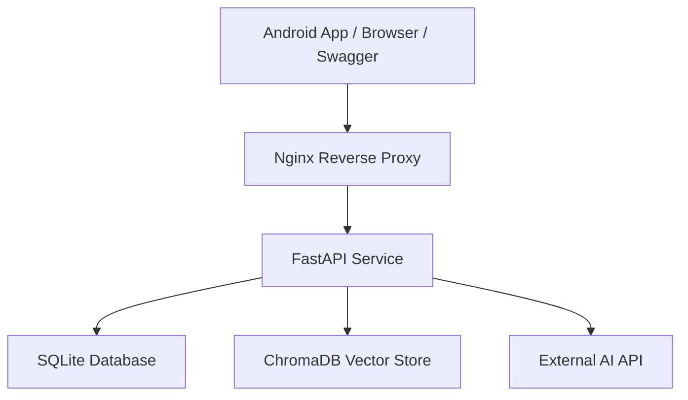
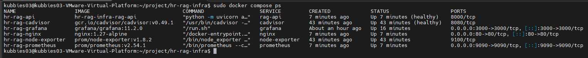
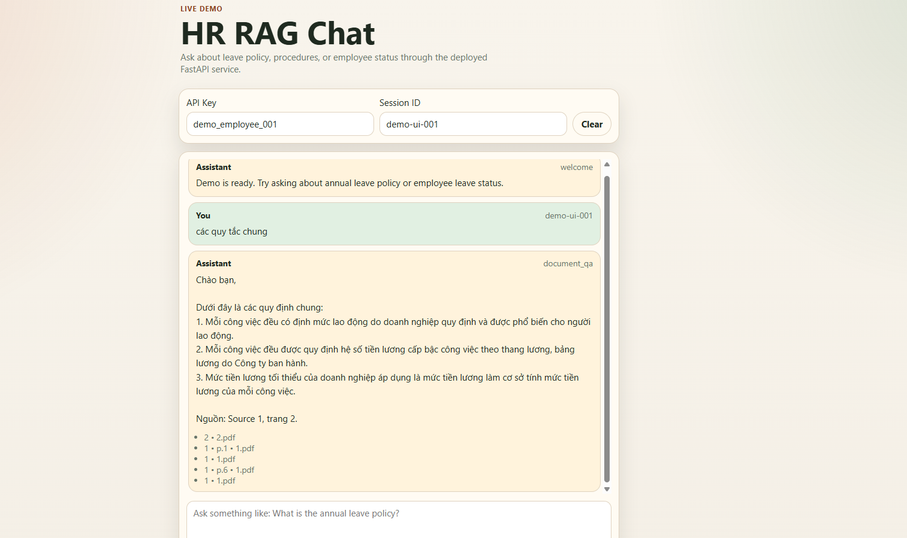
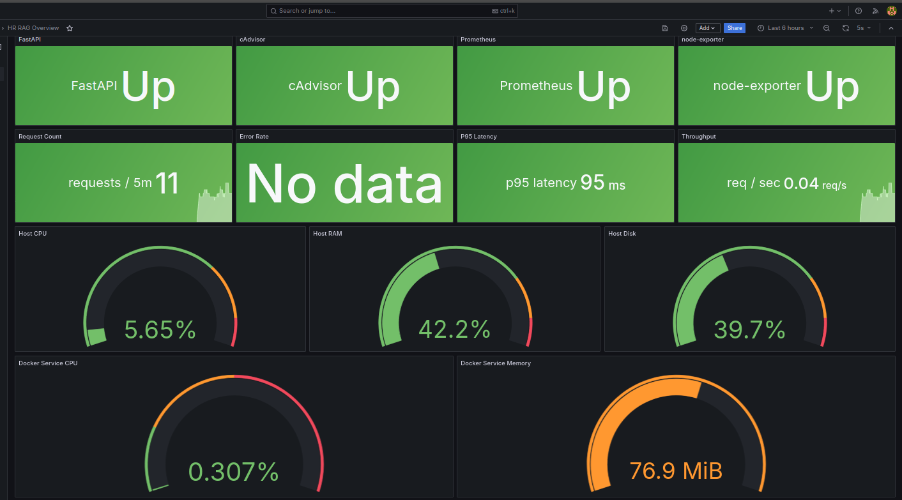

# System Engineer Lab - Dockerized HR Service Deployment

This repository focuses on service deployment and operations more than AI experimentation. It packages an existing HR question-answering backend into a Linux-ready stack with Docker Compose, Nginx reverse proxy, persistent storage, backup and restore, monitoring, and a browser demo that can be shared through ngrok.

1. Project Overview
2. System Architecture
3. Deployment Architecture
4. Tech Stack
5. Folder Structure
6. Environment Variables
7. How to Run
8. API Testing
9. Data Persistence
10. Backup & Restore
11. Monitoring
12. Troubleshooting
13. Future Improvements

## 1. Project Overview

- Deployable on Linux with Docker Compose
- Reverse proxied through Nginx on port `80`
- Persistent storage for SQLite, ChromaDB, and uploaded documents
- Backup and restore workflow for core runtime data
- Health check and metrics endpoints for service readiness
- Monitoring with Prometheus, Grafana, Node Exporter, and cAdvisor
- Public demo support through a lightweight browser chat UI and ngrok

Service scope:

- Employee status questions are answered from HR data.
- Policy and procedure questions are answered from indexed internal documents.
- Out-of-scope questions are declined through the application layer.

From a System Engineer perspective, the main value of this repo is the deployable runtime package: reverse proxy, container orchestration, mounted stateful directories, health verification, observability, and simple operational runbooks.

## 2. System Architecture



## 3. Deployment Architecture

```text
Client / Browser / Android App
            |
            v
      Nginx Reverse Proxy
            |
            v
        FastAPI Service
            |
            v
  SQLite + ChromaDB + Docs Volumes
            |
            v
      External AI API
```

## 4. Tech Stack

| Layer | Technology |
|---|---|
| Platform | Linux, Docker, Docker Compose |
| Reverse proxy | Nginx |
| API | FastAPI, Uvicorn |
| External inference | Google Gemini API |
| Vector store | ChromaDB |
| Database | SQLite, SQLAlchemy |
| Authentication | Firebase Auth, demo API key |
| Notifications | Firebase Cloud Messaging |
| Monitoring | Prometheus, Grafana, Node Exporter, cAdvisor |
| Scripting | Bash, PowerShell |

Infrastructure highlights:

- Dockerized backend with health checks
- Compose-managed multi-service deployment
- Nginx reverse proxy in front of the backend
- Persistent data mounts for SQLite, ChromaDB, and source documents
- Backup and restore scripts for runtime data
- Ubuntu monitoring target with Prometheus, Grafana, Node Exporter, and cAdvisor
- Browser-based demo UI served by Nginx
- ngrok-ready public demo flow

Application highlights:

- HTTP API for HR data and policy lookup
- Role-based document access filtering
- Document ingest pipeline backed by ChromaDB
- Conversation history persistence
- Request logging with latency tracking
- Demo and production auth modes

Requirements:

- Python 3.11+
- Docker + Docker Compose for Linux-style deployment
- Google Gemini API key for application responses
- Firebase service account, optional for production auth and Firestore

## 5. Folder Structure

```text
hr-rag-infra/
|-- app/
|   |-- api/
|   |-- core/
|   |-- data/
|   |-- db/
|   |-- prompts/
|   |-- services/
|   `-- main.py
|-- assets/
|   `-- screenshots/
|-- data/
|   |-- docs/
|   |-- chroma/
|   `-- sqlite/
|-- frontend/
|-- monitoring/
|-- nginx/
|-- scripts/
|-- .env.example
|-- docker-compose.yml
|-- docker-compose.ubuntu-monitoring.yml
|-- Dockerfile
|-- README.md
`-- requirements.txt
```

## 6. Environment Variables

| Variable | Description | Default |
|---|---|---|
| `GOOGLE_API_KEY` | External AI API key used by the application layer | required |
| `GEMINI_EMBEDDING_MODEL` | Embedding backend model name | `models/gemini-embedding-001` |
| `GEMINI_EMBEDDING_BATCH_SIZE` | Batch size for document embedding requests | `100` |
| `GEMINI_EMBEDDING_TIMEOUT` | Timeout for embedding calls, seconds | `30` |
| `RERANKER_PROVIDER` | Optional reranker backend | `gemini` |
| `USE_RERANKER` | Enable reranking | `false` |
| `RERANKER_TIMEOUT` | Timeout for reranking calls, seconds | `20` |
| `RERANKER_MAX_DOC_CHARS` | Max chars per candidate chunk sent to reranker | `1200` |
| `RERANKER_MIN_SCORE` | Minimum reranker score | `0.3` |
| `DATABASE_URL` | SQLite connection string | `sqlite:///data/sqlite/hr.db` |
| `CHROMA_PERSIST_DIR` | ChromaDB storage directory | `data/chroma` |
| `DOCS_DIR` | Source documents directory | `data/docs` |
| `FIREBASE_PROJECT_ID` | Firebase project ID | required for production |
| `FIREBASE_CREDENTIALS_PATH` | Path to service account JSON | `firebase-service-account.json` |

Authentication:

Demo mode uses the `X-API-Key` header.

| Key | Role |
|---|---|
| `demo_employee_001` | employee |
| `demo_hr_001` | hr |
| `demo_manager_001` | manager |
| `demo_admin_001` | admin |

Production mode uses a Firebase ID token:

```http
Authorization: Bearer <firebase_id_token>
```

## 7. How to Run

This repo includes the deploy package described in `deploy.md`:

- `Dockerfile`
- `docker-compose.yml`
- `nginx/nginx.conf`
- `scripts/backup.sh`
- `scripts/restore.sh`

### 7.1 Prepare environment

Create a `.env` file in the project root:

```bash
cp .env.example .env
```

Then fill in at least:

```text
GOOGLE_API_KEY=...
FIREBASE_PROJECT_ID=...
FIREBASE_CREDENTIALS_PATH=firebase-service-account.json
```

If you do not use Firebase yet, keep the API key and document volumes ready for demo mode.

### 7.2 Build and start

```bash
docker compose up -d --build
docker compose ps
```

### 7.3 Test health

```bash
curl http://localhost/health
curl http://localhost/docs
```

Nginx listens on port `80` and proxies traffic to the FastAPI container on port `8000`.

### 7.4 Open the demo chat UI

The repo includes a lightweight browser chat client served by Nginx:

```text
http://localhost/demo/
```

It calls `POST /api/chat` through the reverse proxy, so you can demo the deployed service without Swagger or Postman.

### 7.5 Ingest documents after first deploy

Copy your `.pdf`, `.docx`, or `.txt` files into `data/docs/`, then ingest them:

```bash
docker compose exec rag-api python -c "from app.services.ingest_service import ingest_directory; import json; print(json.dumps(ingest_directory(), ensure_ascii=False, indent=2))"
curl http://localhost/health
```

For a public API test through Nginx:

```bash
curl -X POST "http://localhost/api/chat" \
  -H "Content-Type: application/json" \
  -H "X-API-Key: demo_employee_001" \
  -d '{"message":"What is the annual leave policy?","session_id":"deploy-test-001"}'
```

## 8. API Testing

### Chat

```http
POST /api/chat
X-API-Key: demo_employee_001
Content-Type: application/json

{
  "message": "What is the annual leave policy?",
  "session_id": "sess_001"
}
```

### Other endpoints

| Method | Endpoint | Auth | Description |
|---|---|---|---|
| `GET` | `/health` | No | Service health check |
| `POST` | `/api/chat` | Yes | Main chat endpoint |
| `POST` | `/api/documents/ingest` | admin | Upload and index a document |
| `POST` | `/api/documents/ingest-all` | admin | Ingest every file in `data/docs/` |
| `GET` | `/api/documents/stats` | Yes | Vector store statistics |
| `GET` | `/api/employees` | hr / manager / admin | List employees |
| `GET` | `/api/employees/on-leave` | hr / manager / admin | Employees currently on leave |
| `GET` | `/api/logs` | admin | Query history and latency log |
| `POST` | `/api/notify` | hr / admin | Send push notification via FCM |

Legacy aliases `/api/docs/ingest`, `/api/docs/ingest-all`, and `/api/docs/stats` are also supported for backward compatibility.

## 9. Data Persistence

The deployment mounts the following persistent volumes:

- `./data/sqlite:/app/data/sqlite`
- `./data/chroma:/app/data/chroma`
- `./data/docs:/app/data/docs`

This keeps employee data, indexed document data, and source documents after container restarts.

The GitHub infra repo does not ship runtime `data/` contents. The container image creates empty `data/sqlite`, `data/chroma`, and `data/docs` directories automatically, and Docker bind mounts will populate them on the host at runtime.

## 10. Backup & Restore

Create a backup:

```bash
./scripts/backup.sh
```

On Windows PowerShell:

```powershell
.\scripts\backup.ps1
```

Restore from an archive:

```bash
./scripts/restore.sh backups/hr-rag-backup-YYYY-MM-DD-HHMM.tar.gz
```

On Windows PowerShell:

```powershell
.\scripts\restore.ps1 .\backups\hr-rag-backup-YYYY-MM-DD-HHMM.tar.gz
```

## 11. Monitoring

The Compose stack also includes:

- `prometheus` on `http://localhost:9090`
- `grafana` on `http://localhost:3000`
- `node-exporter` in the Ubuntu monitoring override
- `cadvisor` in the Ubuntu monitoring override

Grafana is preconfigured with a Prometheus datasource.

Default Grafana credentials:

```text
username: admin
password: admin
```

Prometheus scrapes:

- `rag-api:8000/metrics`
- `prometheus:9090`

On Windows or Docker Desktop, run the default stack:

```bash
docker compose up -d --build
```

On Ubuntu, run the full monitoring target:

```bash
docker compose -f docker-compose.yml -f docker-compose.ubuntu-monitoring.yml up -d --build
```

Or use the helper script:

```bash
./scripts/deploy_ubuntu.sh
```

The Ubuntu monitoring override adds:

- `node-exporter:9100`
- `cadvisor:8080`
- `monitoring/prometheus.linux.yml`

Grafana also provisions the `HR RAG Overview` dashboard automatically from `monitoring/grafana/dashboards/hr-rag-overview.json`.

To generate API traffic for the dashboard during a demo:

```bash
./scripts/seed_demo_traffic.sh
```

Public demo with ngrok:

```bash
ngrok config add-authtoken YOUR_NGROK_AUTHTOKEN
ngrok http 80
```

Then open:

```text
https://your-ngrok-url.ngrok.app/demo/
```

Telemetry notes:

- `ANONYMIZED_TELEMETRY=False`
- Chroma telemetry is disabled to keep logs cleaner during deploy verification and demos.

## 12. Troubleshooting

### `502 Bad Gateway` from Nginx

If `rag-api` was recreated and Nginx still cached the old upstream IP, restart Nginx:

```bash
docker compose restart nginx
```

### `chromadb: ok (0 chunks)` in `/health`

The service is running, but no documents were indexed yet. Copy files into `data/docs/` and run the ingest command from section `7.5`.

### Grafana shows `No data`

Verify the Ubuntu monitoring stack is running:

```bash
docker compose -f docker-compose.yml -f docker-compose.ubuntu-monitoring.yml ps
curl http://localhost:9090/api/v1/query?query=up
```

If Prometheus has data, restart Grafana:

```bash
docker compose -f docker-compose.yml -f docker-compose.ubuntu-monitoring.yml restart grafana
```

### Docker permission denied on Ubuntu

Use `sudo docker compose ...` or add the current user to the Docker group:

```bash
sudo usermod -aG docker $USER
newgrp docker
```

### Service notes

- External AI dependencies were moved to API-backed providers to keep Linux deployment lighter.
- Reranking is disabled by default so the base stack only needs FastAPI, SQLite, ChromaDB, and outbound API access.
- If you change embedding settings, re-ingest the files in `data/docs/` before validating retrieval again.

## 13. Future Improvements

- Add HTTPS termination with Let's Encrypt or Cloudflare Tunnel
- Add alerting rules for uptime, disk pressure, and latency spikes
- Export structured logs to Loki or ELK
- Replace demo auth with production Firebase-first flows in deployment docs
- Add CI to validate Compose, Prometheus, and Grafana provisioning on every push

## Demo Evidence

Use [assets/screenshots/README.md](assets/screenshots/README.md) as the checklist for GitHub and CV screenshots after deployment.

## Demo Screenshots

### Docker Compose



### Chat Response



### Grafana Dashboard



## Known Limitations

- In-process cache is not shared across multiple workers
- No request throttling on the chat endpoint
- CORS currently allows all origins
- External AI API latency varies with upstream load
- Legacy `.doc` files still require Windows COM automation
